

# Mashroo3i — مشروعي

**Your AI co-founder for the Jordanian market**

---

## Overview

Most business ideas fail not because they're bad — but because founders never stress-tested them before spending money.

Mashroo3i gives Jordanian entrepreneurs an honest, data-grounded answer to one question: *is this idea worth pursuing?* You describe your idea, and the platform returns a full investment-grade report — scoring across five dimensions, a SWOT breakdown, competitive positioning, market sizing, and a 12-month financial model — all calibrated to Jordan's economy, not some generic global dataset.

It's not a chatbot. It's a structured evaluation workflow with a credit-based business model, user accounts, and persistent results — built to be a real product.

---

## The Platform

### Landing Page

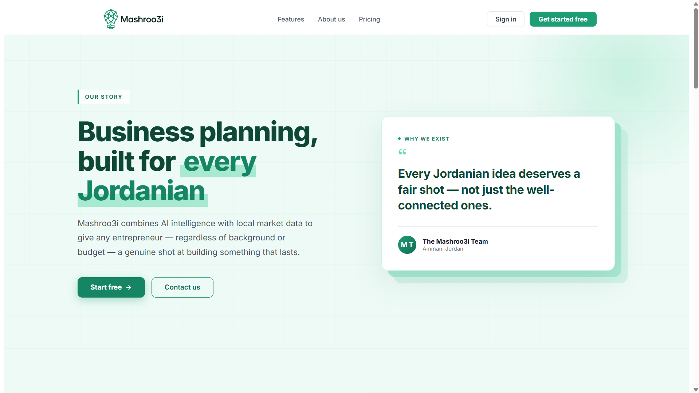

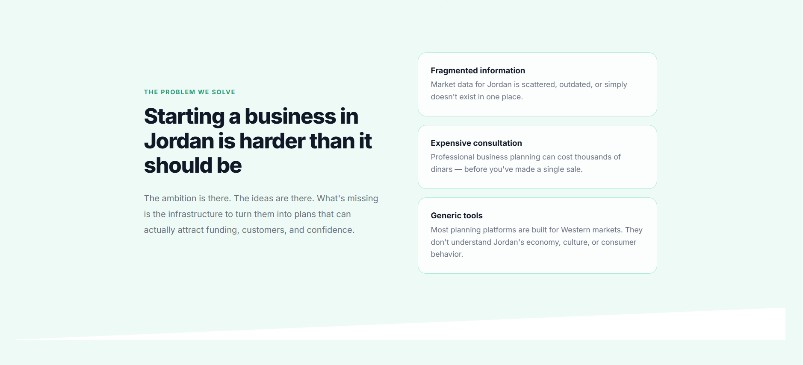

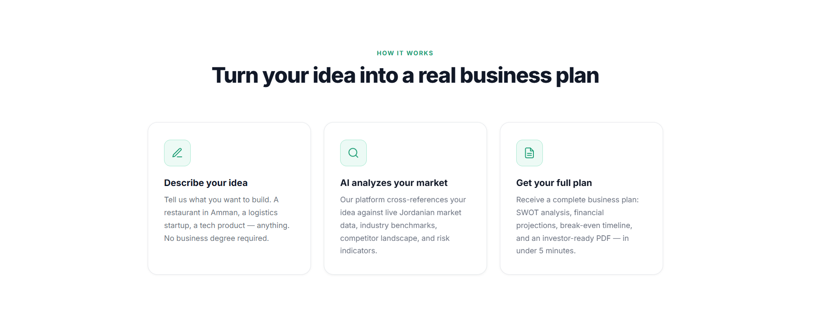

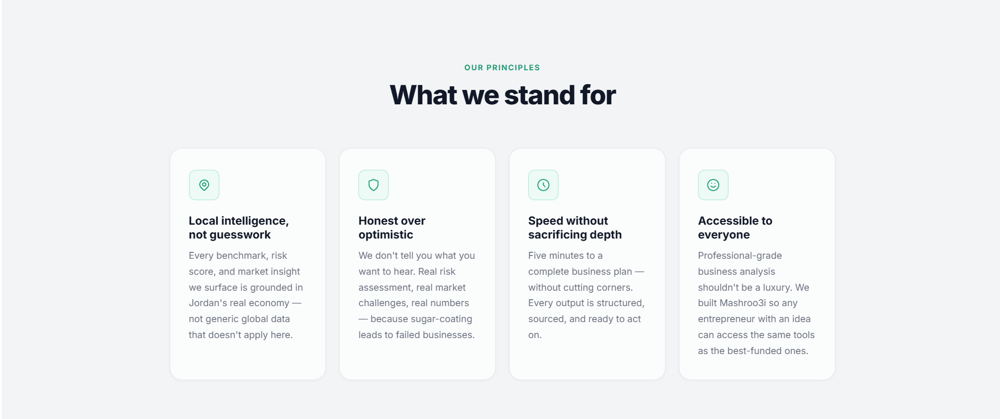

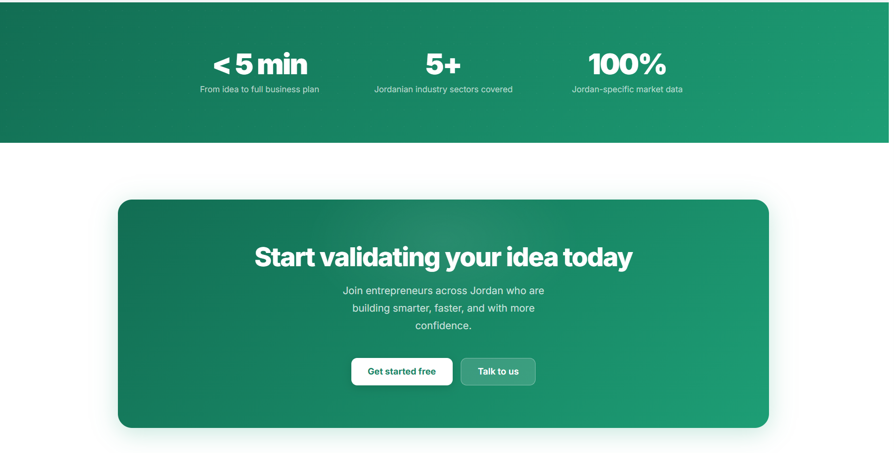

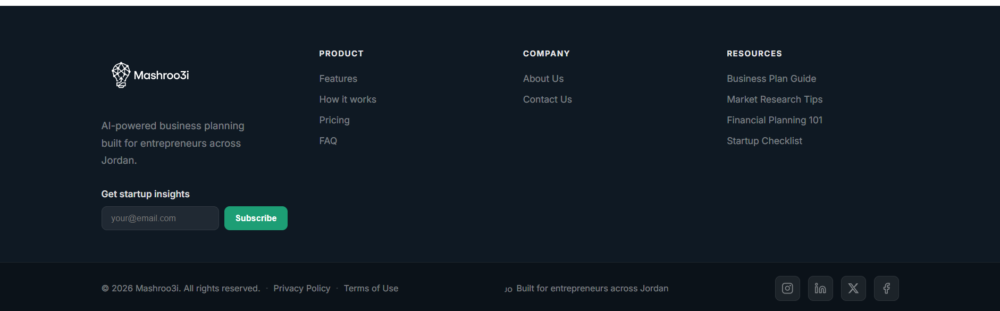

---

### AI Evaluation Report

Submit your idea and get back a scored, structured report across four tabs — AI Evaluation, SWOT & Risk, Market, and Financial Projections.

**Scoring & Recommendations**

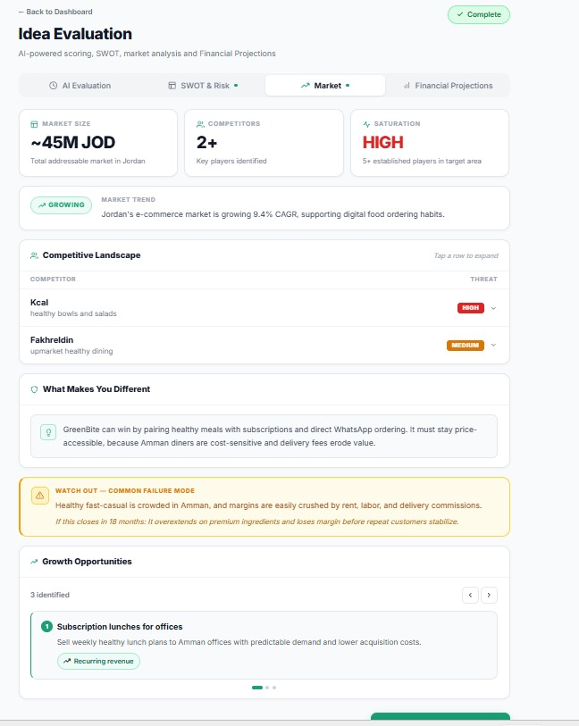

**SWOT & Risk Analysis**

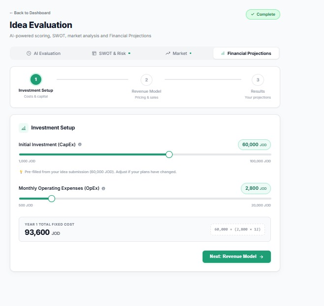

**Market Analysis**

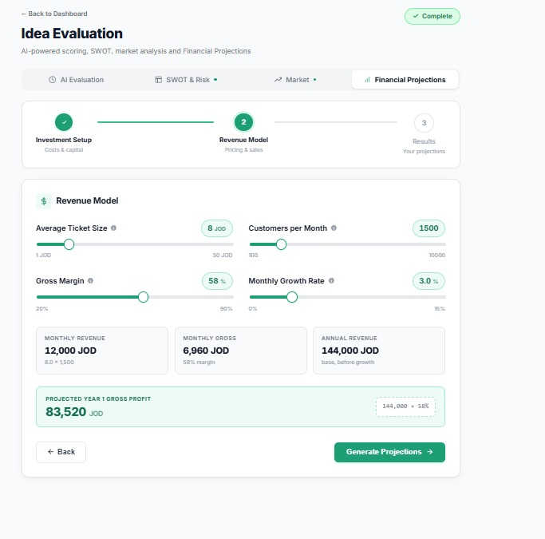

---

### Financial Projections

An interactive 3-step financial model. Dial in your costs, revenue assumptions, and growth rate — then see your full Year 1 P&L, break-even month, and ROI.

**Step 1 — Investment Setup**

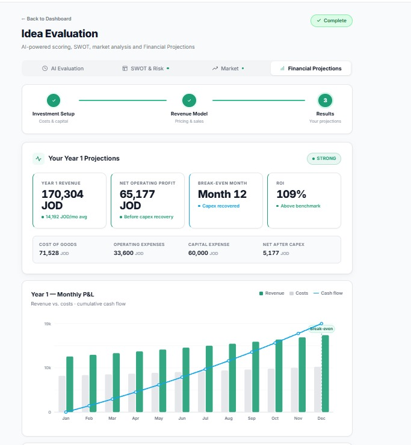

**Step 2 — Revenue Model**

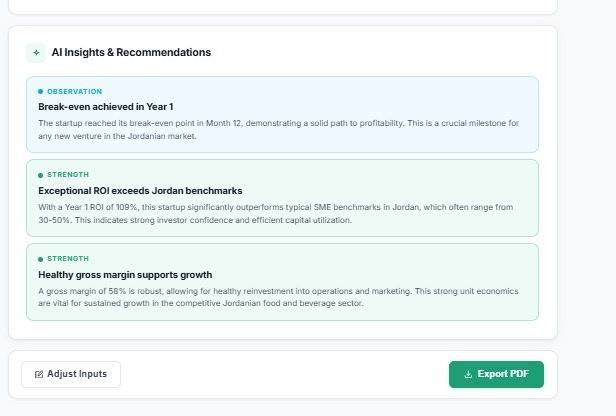

**Step 3 — Results**

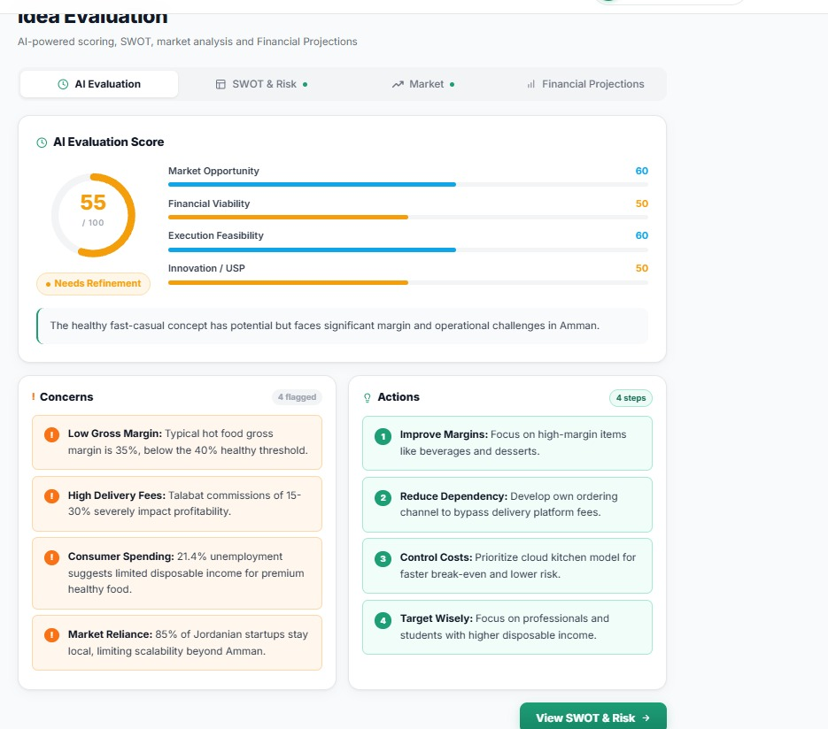

**AI Insights**

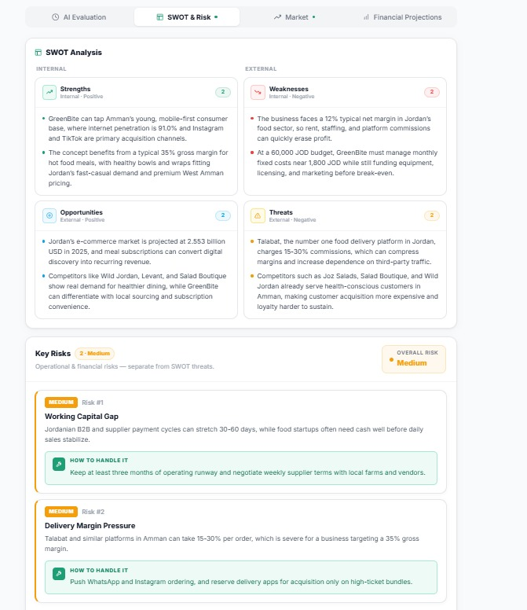

---

## Key Capabilities

**For the entrepreneur**
- Submit a business idea and receive a scored, written evaluation within minutes
- Understand strengths, risks, and market position before committing any capital
- Build and adjust a financial model interactively — see break-even, revenue curve, and ROI update in real time
- Get AI-generated financial insights benchmarked against Jordanian SME norms

**For the business**
- Credit-based monetization — users pay per evaluation, not a flat subscription
- Persistent user accounts with evaluation history and financial plans
- Built to scale: stateless API, managed database, containerized deployment

---

## Technology

| | |
|---|---|
| **Backend** | ASP.NET Core — handles the API, authentication, and orchestrates the AI evaluation pipeline |
| **Frontend** | React — single-page application with full Arabic/English support |
| **Database** | PostgreSQL via Supabase — stores users, ideas, evaluations, and payment records |
| **AI** | Groq (Llama 3.3 70B) — powers the evaluation, SWOT, market analysis, and financial insights |
| **Deployment** | Railway for the backend, Netlify for the frontend |

---

## Deployment

See the [Deploy branch](https://github.com/Abdallah-Sabha1/Mashroo3i-AI-SaaS-FullStack-Website/tree/Deploy) for production configuration.

---

## License

MIT

---

Built in Jordan 🇯🇴 — for Jordanian entrepreneurs

